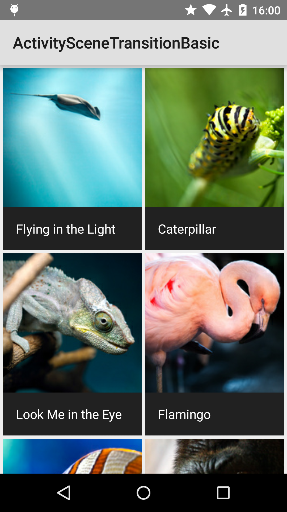
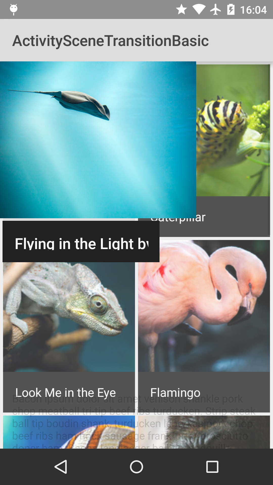
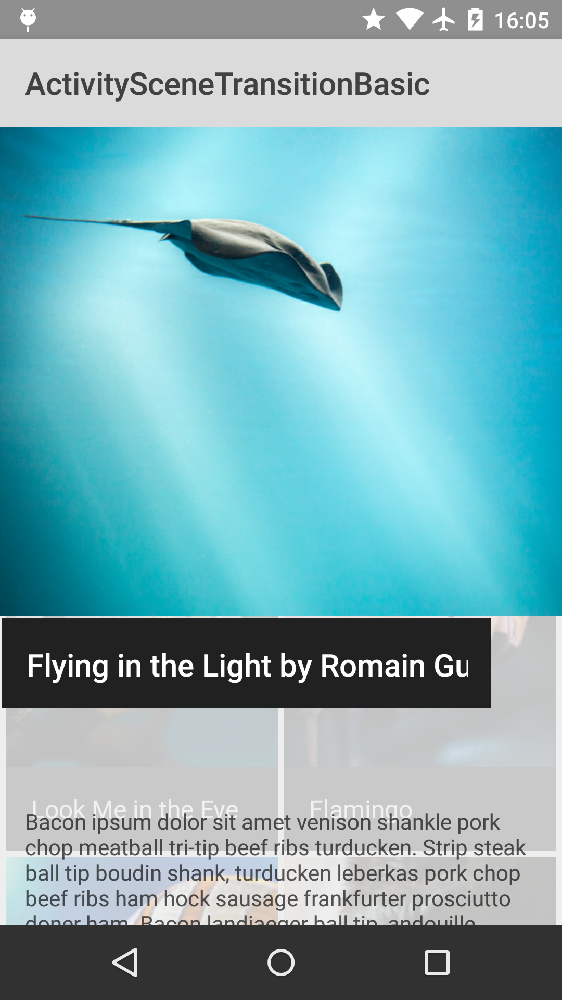
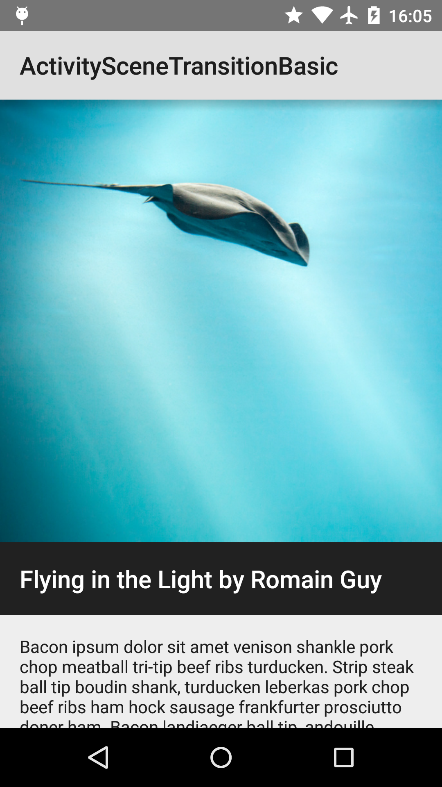

Android ActivitySceneTransitionBasic Sample
===================================

This sample shows how to use scene transitions from one Activity to another in Lollipop.
Uses a combination of changeImageTransform and changeBounds to transition a grid of images
to an Activity with a large image and detail text.

Introduction
------------

Android Lollipop has introduced the ability to transition between activities by using a shared element.
This sample demonstrates how to do this using the theme of your application.

See [Defining Custom Animations][1] for all the details on how to do this.

[1]: https://developer.android.com/training/material/animations.html#Transitions

Pre-requisites
--------------

- Android SDK 28
- Android Build Tools v28.0.3
- Android Support Repository

Screenshots
-------------

    

Getting Started
---------------

This sample uses the Gradle build system. To build this project, use the
"gradlew build" command or use "Import Project" in Android Studio.

Support
-------

- Stack Overflow: http://stackoverflow.com/questions/tagged/android

If you've found an error in this sample, please file an issue:
https://github.com/android/animation

Patches are encouraged, and may be submitted by forking this project and
submitting a pull request through GitHub. Please see CONTRIBUTING.md for more details.
