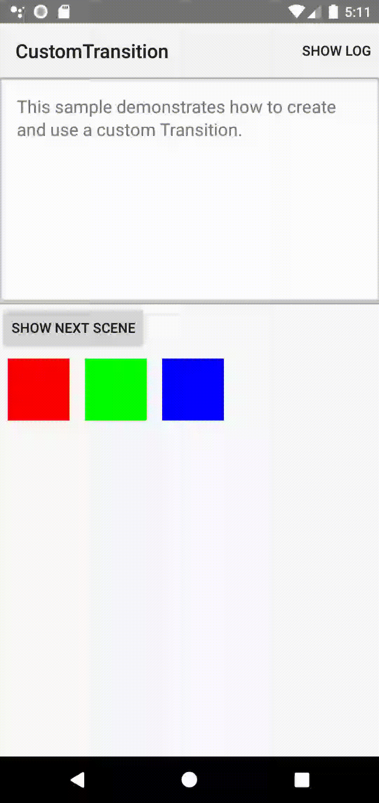

Android CustomTransition Sample
===================================

This sample shows how to implement a custom Transition extending the
standard Transition class.

Introduction
------------

In order to create a custom Transition, you first need to override
[captureStartValues][1] and [captureEndValues][2]. In those method, you have to
extract all the relevant properties from a View. These methods are called for
each of the Views in the hierarchy.

Then, you need to override [createAnimator][3] and create an Animator based on
the property values you extracted. This method will also be called for each of
the Views in the hierarchy. If you want to skip some Views, simply return null.

The instantiated custom Transition can be applied by passing it as the second
parameter of [TransitionManager.go][4].

```java
TransitionManager.go(mScenes[mCurrentScene], mTransition);
```

[1]: https://developer.android.com/reference/android/transition/Transition.html#captureStartValues(android.transition.TransitionValues)
[2]: https://developer.android.com/reference/android/transition/Transition.html#captureEndValues(android.transition.TransitionValues)
[3]: https://developer.android.com/reference/android/transition/Transition.html#createAnimator(android.view.ViewGroup, android.transition.TransitionValues, android.transition.TransitionValues)
[4]: https://developer.android.com/reference/android/transition/TransitionManager.html#go(android.transition.Scene, android.transition.Transition)

Pre-requisites
--------------

- Android SDK 28
- Android Build Tools v28.0.3
- Android Support Repository

Screenshots
-------------

 

Getting Started
---------------

This sample uses the Gradle build system. To build this project, use the
"gradlew build" command or use "Import Project" in Android Studio.

Support
-------

- Stack Overflow: http://stackoverflow.com/questions/tagged/android

If you've found an error in this sample, please file an issue:
https://github.com/android/animation

Patches are encouraged, and may be submitted by forking this project and
submitting a pull request through GitHub. Please see CONTRIBUTING.md for more details.
