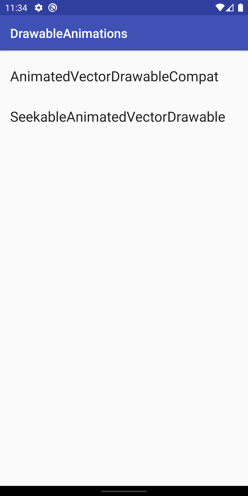
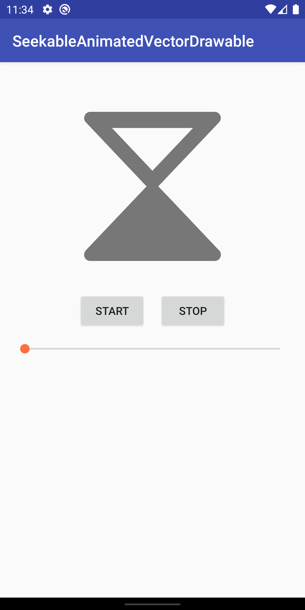
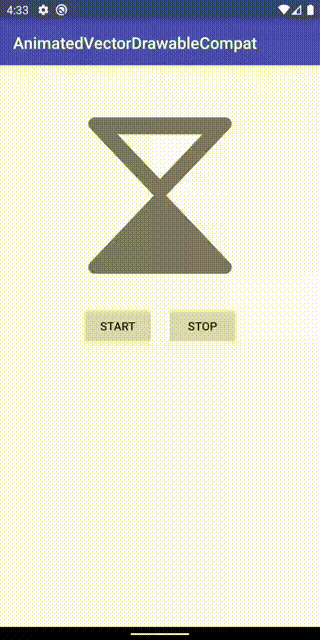
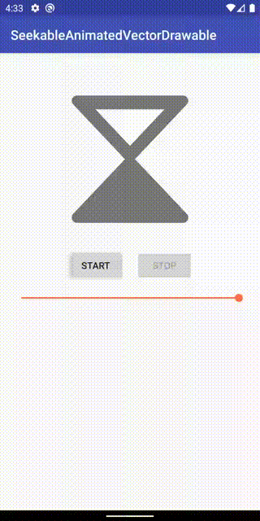

Android DrawableAnimations Sample
=================================

A collection of demos for drawable animation APIs.

## APIs

### AnimatedVectorDrawableCompat

[AnimatedVectorDrawableCompat](https://developer.android.com/reference/android/support/graphics/drawable/AnimatedVectorDrawableCompat)
is backport of
[AnimatedVectorDrawable](https://developer.android.com/reference/android/graphics/drawable/AnimatedVectorDrawable)
introduced in API level 21.

See
[AnimatedFragment.kt](app/src/main/java/com/example/android/drawableanimations/demo/animated/AnimatedFragment.kt)
for how to use AnimatedVectorDrawableCompat.

#### When to use AnimatedVectorDrawableCompat instead of SeekableAnimatedVectorDrawable

When you use `app:srcCompat` in your layout XML, AppCompat instantiates
AnimatedVectorDrawableCompat for older APIs. If you don't need to pause/resume
or seek, this should be sufficient.

### SeekableAnimatedVectorDrawable

[SeekableAnimatedVectorDrawable](https://developer.android.com/reference/androidx/vectordrawable/graphics/drawable/SeekableAnimatedVectorDrawable)
is an alternative to AnimatedVectorDrawableCompat that supports the same XML
format.  SeekableAnimatedVectorDrawable allows more control over animation,
namely pause/resume and seek.  It also provides animation callbacks for those
additional events.

See
[SeekableFragment.kt](app/src/main/java/com/example/android/drawableanimations/demo/seekable/SeekableFragment.kt)
for how to use SeekableAnimatedVectorDrawable.

## Support

- Stack Overflow: https://stackoverflow.com/questions/tagged/android

If you've found an error in this sample, please
[file an issue](https://github.com/android/animation-samples/issues/new).

Patches are encouraged, and may be submitted by forking this project and
submitting a pull request through GitHub. Please see
[CONTRIBUTING.md](../CONTRIBUTING.md) for more details.
