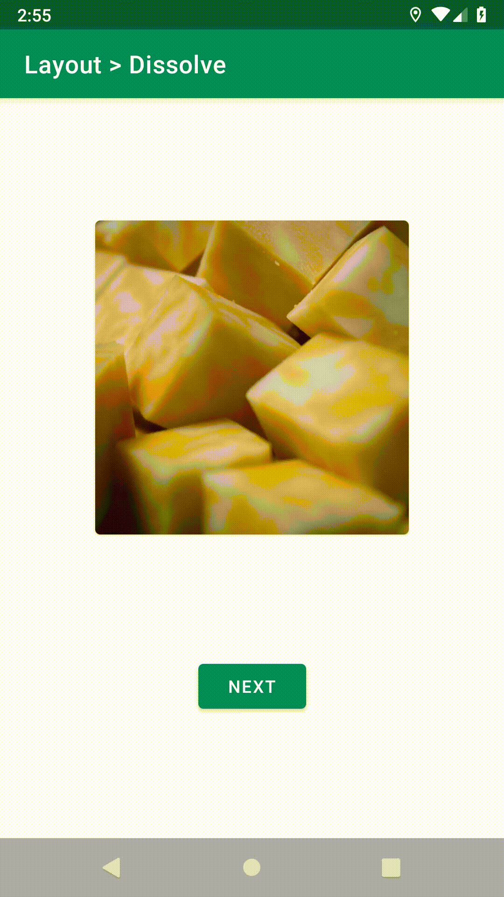
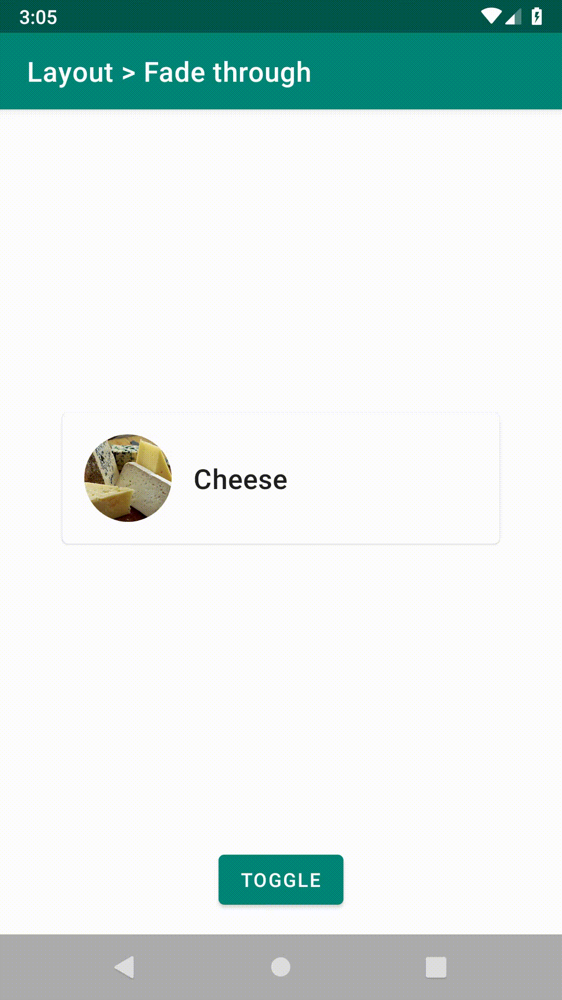
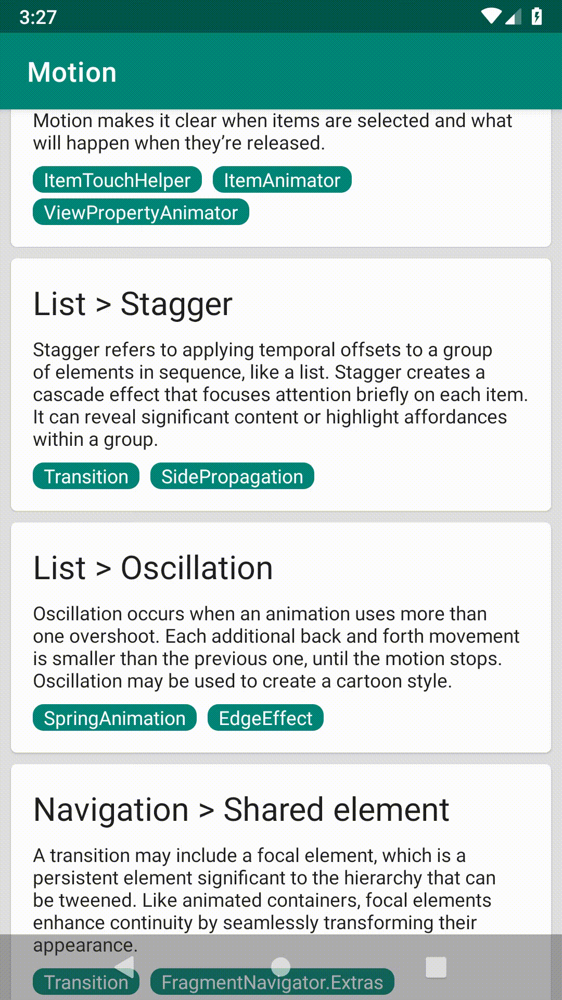
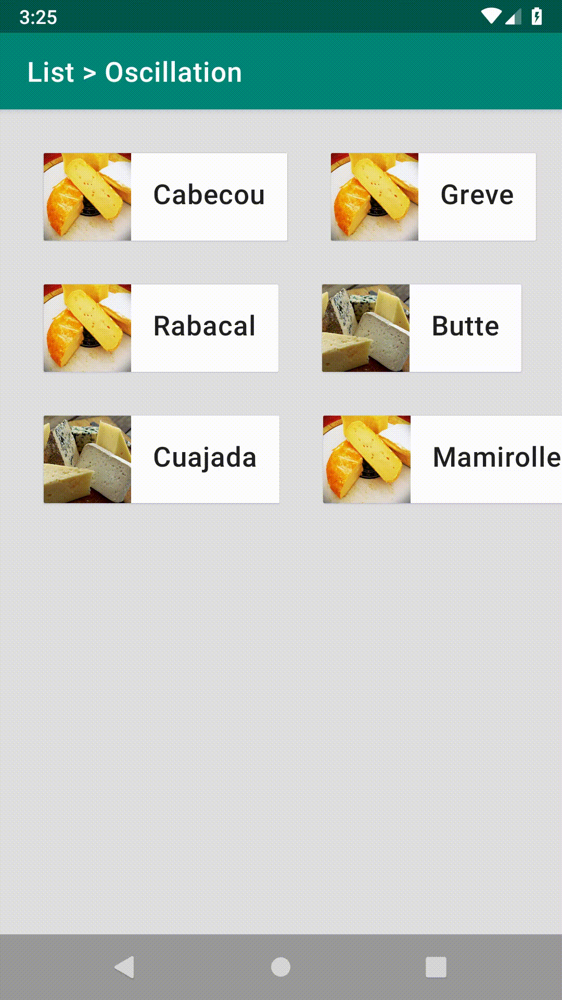
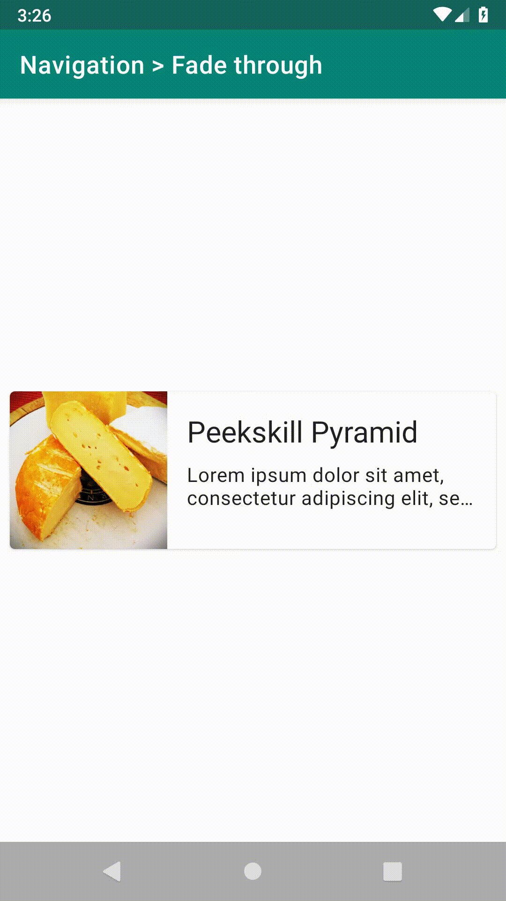

Android Motion Sample
=====================

A collection of demos for Material Design Motion.

[Material Design](https://material.io) provides a lot of examples about motion design. This sample
shows how to implement them on Android.

- [Understanding motion](https://material.io/design/motion/understanding-motion.html)
- [Speed](https://material.io/design/motion/speed.html)
- [Choreography](https://material.io/design/motion/choreography.html)
- [Customization](https://material.io/design/motion/customization.html)

[Animations and Transitions](https://developer.android.com/training/animation) explains how to use
various animation APIs on Android.

All the source codes for demos are in the [demo](app/src/main/java/com/example/android/motion/demo)
package.

### [Layout > Dissolve](app/src/main/java/com/example/android/motion/demo/dissolve)

### [Layout > Fade through](app/src/main/java/com/example/android/motion/demo/fadethrough)

### [Layout > FAB transformation](app/src/main/java/com/example/android/motion/demo/fabtransformation)

### [List > Reorder](app/src/main/java/com/example/android/motion/demo/reorder)

### [List > Stagger](app/src/main/java/com/example/android/motion/demo/stagger)

### [List > Oscillation](app/src/main/java/com/example/android/motion/demo/oscillation)

### [Navigation > Shared element](app/src/main/java/com/example/android/motion/demo/sharedelement)

### [Navigation > Fade through](app/src/main/java/com/example/android/motion/demo/navfadethrough)

